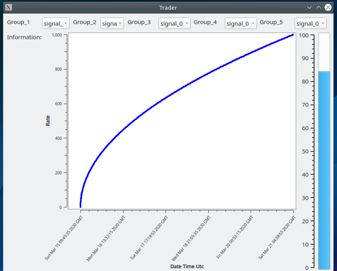

# p_2D_Plot

Requirement
------------
    Qt5:
    ----
        mkdir qt5 && cd qt5
        wget http://download.qt-project.org/official_releases/qt/5.X.X.X.run
        chmod +x 5.X.X.X.run
        ./qt-opensource-linux-x64-5.X.X.X.run
